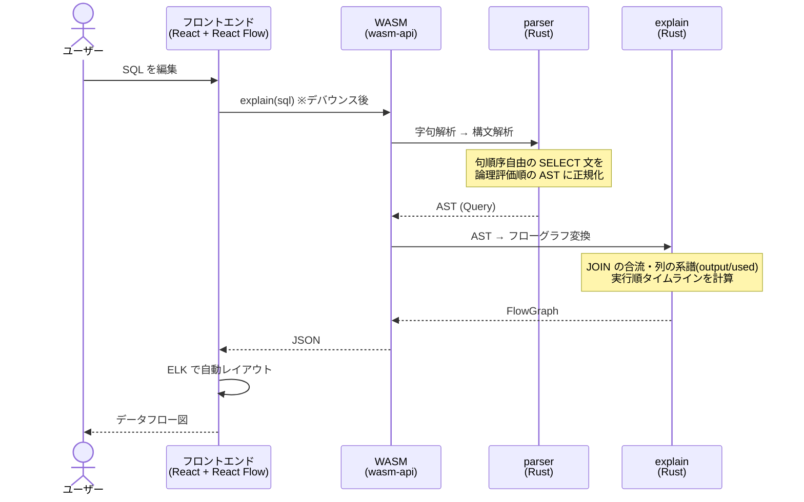

# SQL Flow — SELECT 文のデータフロー可視化

SELECT 文専用の SQL パーサーを **Rust のパーサーコンビネータで自作**し、
クエリを「集合がどう形作られ、絞られ、選択されるか」の**データフロー図**として
ブラウザ上に描くプロジェクト。パーサーは WASM としてブラウザ内で動く。

## 特徴

- **FROM-first 構文** — 標準の `SELECT ... FROM ...` に加えて、
  `FROM users WHERE age >= 20 SELECT id, name` のように
  論理的な評価順で書き始められる(句の順序は自由・意味は同じ AST に正規化)
- **JOIN は「合流」として描く** — JOIN ノードは作らず、2つの集合が
  1つの結合済みテーブルに合流する。結合キーはそれぞれの矢印上に表示
- **列の系譜(lineage)** — SQL に現れた列だけを事実として表示し、
  「最終結果に届く列」と「条件にのみ使われる列」を色で区別。
  現れていない列の存在は `…` で示す
- **論理実行順の可視化** — フローの並び(WITH → FROM → JOIN → WHERE →
  GROUP BY → SELECT → …)がそのまま実行順。長文 SQL の読解や
  「どの段階で絞るべきか」というチューニングの検討に使える

## 起動方法

前提: Rust(rustup)、Node.js + pnpm、wasm-pack

```sh
# 初回のみ: WASM ビルドの準備
rustup target add wasm32-unknown-unknown
cargo install wasm-pack

# フロントエンドの起動
cd frontend
pnpm install
pnpm build:wasm   # Rust → WASM(Rust 側を変更したら再実行)
pnpm dev          # http://localhost:5173
```

CLI で AST を確認することもできる:

```sh
cargo run -- "FROM users u JOIN orders o ON u.id = o.user_id SELECT u.name"
```

## 全体像

SQL を編集すると、ブラウザ内の Rust パーサー(WASM)が AST →
フローグラフに変換し、React Flow が描画する。



より詳細なシーケンス(モジュール単位)は
[docs/02_architecture.md](./docs/02_architecture.md) を参照。

## 構成

### バックエンド(Rust ワークスペース)

パーサーは外部ライブラリに頼らず、`Parser<I, T>` 型と
Functor / Applicative / Alternative / Monad のコンビネータで組み上げている。
入力型がジェネリックなので、**字句解析(文字列)と構文解析(トークン列)が
同じコンビネータを共有**する。

| クレート | 役割 |
| --- | --- |
| [kernel/](./kernel/) | コンビネータの核。`Parser<I, T>`・型クラス・`many0` / `sep_by1` など |
| [basic-parser/](./basic-parser/) | 汎用の基本パーサー(`char` / `digit` / `string` / …) |
| [tokenizer/](./tokenizer/) | SQL 字句解析。文字列 → `Vec<Token>`([仕様](./docs/04_tokenizer_spec.md)) |
| [parser/](./parser/) | 構文解析。トークン列 → AST。**句順序自由化**はここ([文法](./docs/05_grammar_spec.md)) |
| [explain/](./explain/) | AST → フローグラフ変換。列の系譜・実行順タイムラインの計算 |
| [wasm-api/](./wasm-api/) | wasm-bindgen で `parse()` / `explain()` を公開 |

### WASM API

`wasm-pack` で `frontend/src/wasm/pkg` にビルドされ、ブラウザ内で実行される。

| 関数 | 返り値(JSON) | 用途 |
| --- | --- | --- |
| `explain(sql)` | FlowGraph(ノード・エッジ・実行順) | 可視化の本命 API |
| `parse(sql)` | AST | デバッグ用 |

FlowGraph の契約(ノード種別・列の系譜・タイムライン)は
[docs/06_api_design.md](./docs/06_api_design.md) を参照。

### フロントエンド([frontend/](./frontend/))

Vite + React + TypeScript。キャンバスは @xyflow/react(React Flow)、
自動レイアウトは elkjs、スタイリングは Tailwind CSS + Base UI。
「グラフ変換 → レイアウト → ハイライト」を純粋関数として分離している。
デザイン(kawaii × 見やすい)の詳細は
[docs/07_ui_design.md](./docs/07_ui_design.md) を参照。

## ドキュメント

| ドキュメント | 内容 |
| --- | --- |
| [01_overview.md](./docs/01_overview.md) | プロジェクトのゴールとスコープ |
| [02_architecture.md](./docs/02_architecture.md) | アーキテクチャ・データの流れ(詳細シーケンス図) |
| [03_roadmap.md](./docs/03_roadmap.md) | 開発ロードマップ(フェーズ別チェックリスト・現在地) |
| [04_tokenizer_spec.md](./docs/04_tokenizer_spec.md) | 字句解析の仕様 |
| [05_grammar_spec.md](./docs/05_grammar_spec.md) | 文法(EBNF)・句順序自由化・AST |
| [06_api_design.md](./docs/06_api_design.md) | WASM API と FlowGraph 契約 |
| [07_ui_design.md](./docs/07_ui_design.md) | UI 設計・描画ルール・デザイントークン |

## 開発コマンド

```sh
cargo test --workspace      # Rust 側のテスト
cargo clippy --workspace    # Lint
cargo run -- "<SQL>"        # AST の確認

cd frontend
pnpm build:wasm             # Rust → WASM
pnpm dev                    # 開発サーバー
pnpm build                  # 型チェック + プロダクションビルド
node scripts/wasm-smoke.mjs # WASM 経由の動作確認
```

## デプロイ(kseo.ink/works/sql-flow)

静的アセットのみの Cloudflare Worker として、kseo.ink 本体(asobi)とは
独立にデプロイする。パスが具体的なルートが優先されるため、本体の設定変更は不要。

```sh
cd frontend
pnpm run deploy:works   # WASM ビルド → vite build --base ./ → .deploy にステージング → wrangler deploy
```

- 設定: [frontend/wrangler.works.jsonc](./frontend/wrangler.works.jsonc)
  (ルート `kseo.ink/works/sql-flow*`)
- 配信パスを変える場合は wrangler.works.jsonc の `routes.pattern` と
  [frontend/scripts/stage-deploy.mjs](./frontend/scripts/stage-deploy.mjs) の
  ディレクトリ名を合わせて変更する
