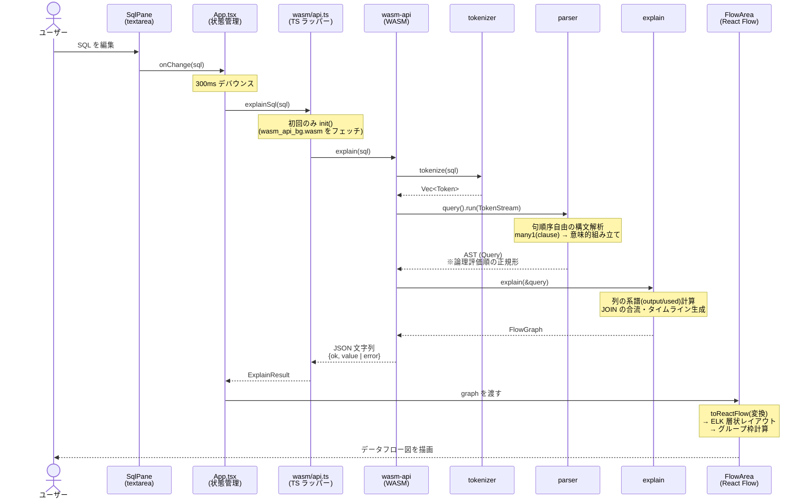

# アーキテクチャ

## パーサーコンビネータの核（kernel）

### Parser 型

```rust
pub trait ParseInput: Clone { fn len(&self) -> usize; }

pub type ParseResult<I, T> = Option<(T, I)>;
pub struct Parser<I, T>(pub Box<dyn Fn(I) -> ParseResult<I, T>>);
pub type StrParser<T> = Parser<String, T>; // 字句解析用
```

- 入力 `I` を受け取り、成功なら `(パース済みの値, 残りの入力)` を返す。
- `Box<dyn Fn>` でラップすることで、環境をキャプチャするクロージャもパーサーにできる。
- 入力型をジェネリック化しており、字句解析は `I = String`、
  構文解析は `I = TokenStream`（`Rc<Vec<Token>>` + 現在位置。clone が安価）を使う。

### 型クラス（Haskell 対応）

| trait | Haskell | 提供するもの |
| --- | --- | --- |
| `Functor` | `fmap` / `<$>` | `map` … 結果値への関数適用 |
| `Applicative` | `pure` / `<*>` | `pure` … 値の持ち上げ、`ap` … パーサーの合成 |
| `Alternative` | `empty` / `<|>` | `empty` … 常に失敗、`alt` … 左が失敗したら右 |
| `Monad` | `>>=` | `and_then` … 前の結果に応じて次のパーサーを決める |
| `RightFunctor` | `$>` | `replace_with` … 結果を固定値に差し替え |

`ap` は「関数を返すパーサー `p`」を先に実行し、続けて `self` を実行する。
`rest_parser.ap(cons)` は Haskell の `cons <*> rest_parser` に対応する
（レシーバと引数の役割が Haskell と逆であることに注意）。

### 基本要素・コンビネータ

- `satisfy(predicate)` … 先頭 1 文字が述語を満たせば消費する（全パーサーの原点）
- `many0(p)` / `many1(p)` … Haskell の `many` / `some`。0 回以上 / 1 回以上の繰り返し

## レイヤー構造

```
文字列
  │  tokenizer（字句解析）
  ▼
Vec<Token>
  │  parser（構文解析・今後実装）
  ▼
AST（SelectStatement）
  │  wasm-api（今後実装、serde で JSON 化）
  ▼
TypeScript / Web フロントエンド
```

- **tokenizer**: 空白・コメントの処理、キーワードの大文字小文字の吸収を担当。
  以降のレイヤーは「意味のある単位（トークン）」だけを扱えばよくなる。
- **parser**: トークン列に対するコンビネータで AST を構築。
  句順序の自由化は「句パーサーの繰り返し + 意味的な組み立て」で実現する
  （詳細は [05_grammar_spec.md](./05_grammar_spec.md)）。

## レイヤー構造の実装状況

```
文字列 ──tokenizer──▶ Vec<Token> ──parser──▶ AST(Query)
```

- **parser クレート**: `TokenStream`（コメント除去済みトークン列）に対する
  コンビネータで AST を構築する。
  - 式は優先順位ごとの再帰下降（OR < AND < NOT < 比較・述語 < 加減 < 乗除 < 単項・原子）
  - **句順序自由化**は `many1(clause)` + 意味的な組み立て（`assemble`）で実現。
    重複句は失敗、FROM は必須、SELECT 省略時は `*` とみなす
  - AST の `SelectBody` は句の出現順に依存しない論理評価順の正規形

## データの流れ(シーケンス)

SQL を編集してからフロー図が描かれるまでの詳細な流れ。



- パース失敗時は `{ok: false, error}` が返り、App は**直前の正常なグラフを残したまま**
  エラーメッセージだけを表示する
- ノードホバー時は WASM を経由せず、フロント側の純粋関数
  (`collectUpstream` / `highlightNodes` / `highlightEdges`)だけで上流経路を再計算する

## 設計上のメモ・既知の課題

1. **字句解析の入力が `String`（所有権あり）である**
   `alt` などで入力を `clone()` しており、長い入力では非効率。
   学習目的の明快さを優先して現状維持とし、将来
   `&str` + 位置（オフセット）ベースの入力型へのリファクタリングを検討する
   （エラー位置報告にも必要になる）。
   ※構文解析側の `TokenStream` は `Rc` + 位置なので clone は安価。

2. **エラーが `None` のみで理由・位置を持たない**
   可視化フロントエンドでは「どこでパースに失敗したか」の提示が重要なので、
   `Result<(T, Input), ParseError>` 化を今後行う。
